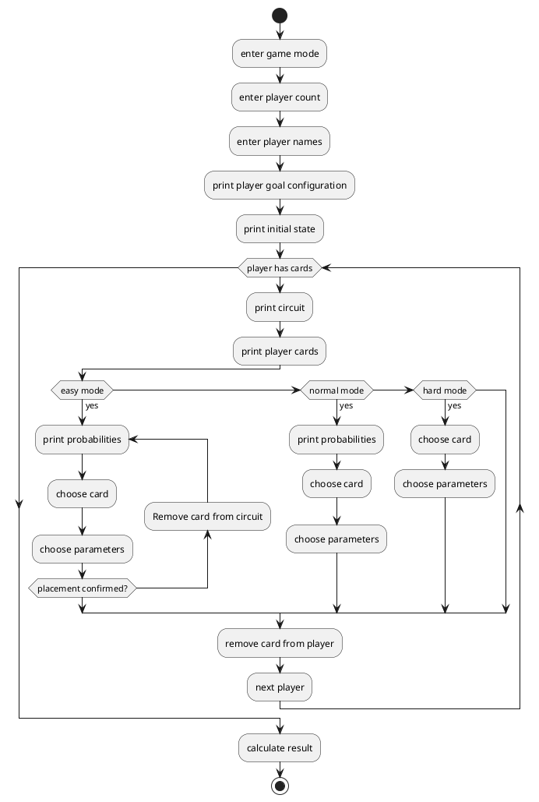

# Team 5 - QUno

We are working on the Informatik2020 Digital Innovation Challenge. We chose the Quantum Computing Challenge with Qiskit from IBM.

## Idea

The idea is to use three qbits as state. This state can be changed by using specific gates, which are represented as cards. Every player gets a target state, which he tries to come close to during the game by placing those gates. At the end the player with the closest target state to the measurement of the complete circuit, which consists of the placed gates, wins.
This approach is a way of gamification of how qbits and the gates work and we hope that it can help people gain fascination for quantum physics.

### Initial state

Before the game starts the number of players, their names, the number of cards per player (same for every player) and the game mode (easy, normal and hard) can be specified. The game modes change the available information for the players and can be seen in the UML-diagram. In easy mode for example a player can view the effects of a gate before he has to confirm the placement. The game can be played with 2 to 8 players. The players get the set number of cards. Every card represents a qbit gate. There are three qbits representing the state. 

### Playing phase

The playing phase is turn-based. In each turn, both players can place a card on one or more qbits of |q0>, |q1> and |q2> depending on the number of arguments of the corresponding gate. After all cards are placed, the playing phase ends.

### Evaluation phase

To evaluate the result of the game, the course of the game is converted to a executable Quibit computation and can be send to an IBM Quibit server. We choose to use the simulation from the Quiskit framework, because it is much faster and we think this is required for a game that could be played multiple times in a row. The player with the lowest hamming distance of his target state and the measured state wins.

### Game loop

**easy mode**\
_normal mode_\
*hard mode*

## Authors

Julia Butte, Sebastian Weber, Thomas Weber
