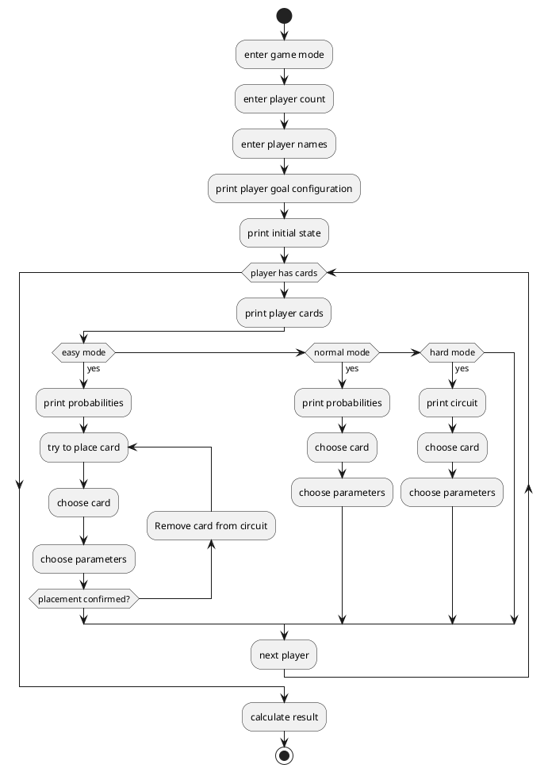

# Team 5 - QUno

We are working on the Informatik2020 Digital Innovation Challenge. We chose the Quantum Computing Challenge with Qiskit from IBM.

## Idea

### Initial state

You play the game QUno with 2 players. Both players draw X cards from the card pile. Every card represents a quibit gate. There are three quibits, one of the is modifiable(x). The starting configuartion looks as following:

```
|0> 
|x> = sqrt(2)/2*|0> + sqrt(2)/2*|1>
|1>
```

### Playing phase

The playing phase is turn-based. In each turn, both players can place a card on either |x>, |0> and |x> / |1> and |x>, |0> and |1> and |x>. The result is returned as the superposition of |x>. After all cards are placed, the playing phase ends.

### Evaluation phase

To evaluate the result of the game, the course of the game is converted to a executable Quibit computation and can be send to an IBM Quibit server. Player 0 wins if the Quibit evaluates to |0>, player 1 wins if the Quibit evaluates to |1>.

Both vectors |0> and |1> can only be used as inputs for binary or ternary operators. Unary operators can only be used on |x>.

### Game loop

**easy mode**\
_normal mode_\
*hard mode*



## Authors

Julia Butte, Sebastian Weber, Thomas Weber
